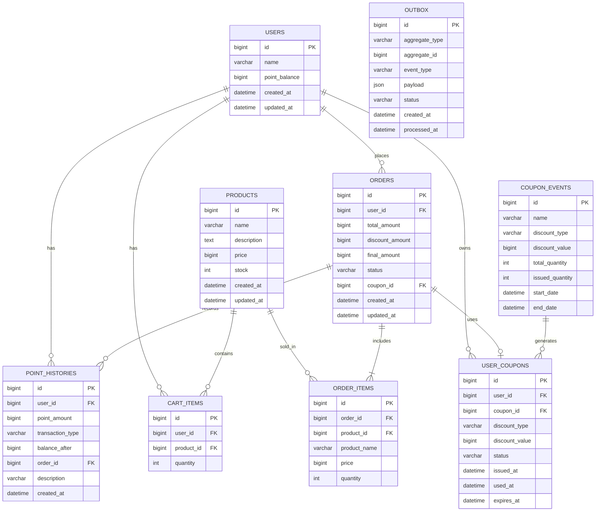

# 이커머스 서비스 데이터 모델

## 목차

1. [개요](#1-개요)
2. [ERD (Entity Relationship Diagram)](#2-erd-entity-relationship-diagram)
3. [엔티티 상세 명세](#3-엔티티-상세-명세)
4. [인덱스 전략](#4-인덱스-전략)
5. [테이블 생성 DDL](#5-테이블-생성-ddl)

---

## 1. 개요

### 1.1 포함 테이블 (총 9개)
1. **users** - 사용자 및 포인트
2. **point_histories** - 포인트 이력
3. **products** - 상품 및 재고
4. **cart_items** - 장바구니
5. **orders** - 주문
6. **order_items** - 주문 상품
7. **coupon_events** - 쿠폰 이벤트
8. **user_coupons** - 사용자 쿠폰
9. **outbox** - outbox

---

## 2. ERD (Entity Relationship Diagram)



---

## 3. 엔티티 상세 명세

### 3.1 USERS (사용자)

**테이블명**: `users`

| 컬럼명        | 타입         | NULL | 기본값            | 설명              |
| ------------- | ------------ | ---- | ----------------- | ----------------- |
| id            | BIGINT       | NO   | AUTO_INCREMENT    | 사용자 ID (PK)    |
| name          | VARCHAR(100) | NO   | -                 | 사용자 이름       |
| point_balance | BIGINT       | NO   | 0                 | 포인트 (원 단위)  |
| created_at    | DATETIME     | NO   | CURRENT_TIMESTAMP | 생성 일시         |
| updated_at    | DATETIME     | NO   | CURRENT_TIMESTAMP | 수정 일시         |

**제약 조건**:

- PRIMARY KEY: `id`
- CHECK: `point_balance >= 0`

**인덱스**:

- PRIMARY: `id`

---

### 3.2 POINT_HISTORIES (포인트 이력)

**테이블명**: `point_histories`

| 컬럼명           | 타입         | NULL | 기본값            | 설명                               |
| ---------------- | ------------ | ---- | ----------------- | ---------------------------------- |
| id               | BIGINT       | NO   | AUTO_INCREMENT    | 포인트 이력 ID (PK)                |
| user_id          | BIGINT       | NO   | -                 | 사용자 ID (FK)                     |
| point_amount     | BIGINT       | NO   | -                 | 포인트 변경량 (충전: 양수, 사용: 음수) |
| transaction_type | VARCHAR(20)  | NO   | -                 | 거래 유형 (CHARGE, USE, REFUND)    |
| balance_after    | BIGINT       | NO   | -                 | 거래 후 잔액                       |
| order_id         | BIGINT       | YES  | NULL              | 주문 ID (FK, USE/REFUND 시)        |
| description      | VARCHAR(255) | YES  | NULL              | 설명                               |
| created_at       | DATETIME     | NO   | CURRENT_TIMESTAMP | 생성 일시                          |

**제약 조건**:

- PRIMARY KEY: `id`
- CHECK: `transaction_type IN ('CHARGE', 'USE', 'REFUND')`

**인덱스**:

- PRIMARY: `id`
- INDEX: `idx_point_histories_user_created` ON (`user_id`, `created_at` DESC)
- INDEX: `idx_point_histories_order` ON (`order_id`)

**참조 관계** (애플리케이션 레벨):

- `user_id` → `users(id)`
- `order_id` → `orders(id)` (nullable)

**비즈니스 규칙**:

- CHARGE: 포인트 충전, point_amount는 양수
- USE: 포인트 사용 (주문 결제), point_amount는 음수, order_id 필수
- REFUND: 포인트 환불 (주문 취소), point_amount는 양수, order_id 필수

---

### 3.3 PRODUCTS (상품)

**테이블명**: `products`

| 컬럼명      | 타입         | NULL | 기본값            | 설명           |
| ----------- | ------------ | ---- | ----------------- | -------------- |
| id          | BIGINT       | NO   | AUTO_INCREMENT    | 상품 ID (PK)   |
| name        | VARCHAR(200) | NO   | -                 | 상품명         |
| description | TEXT         | NO   | -                 | 상품 설명      |
| price       | BIGINT       | NO   | -                 | 가격 (원 단위) |
| stock       | INT          | NO   | 0                 | 재고 수량      |
| created_at  | DATETIME     | NO   | CURRENT_TIMESTAMP | 생성 일시      |
| updated_at  | DATETIME     | NO   | CURRENT_TIMESTAMP | 수정 일시      |

**제약 조건**:

- PRIMARY KEY: `id`
- CHECK: `price > 0`
- CHECK: `stock >= 0`

**인덱스**:

- PRIMARY: `id`

**비즈니스 규칙**:

- 재고 차감 시 `synchronized` 또는 `ReentrantLock` 사용 (애플리케이션 레벨 동시성 제어)

---

### 3.3 CART_ITEMS (장바구니)

**테이블명**: `cart_items`

| 컬럼명     | 타입   | NULL | 기본값         | 설명                  |
| ---------- | ------ | ---- | -------------- | --------------------- |
| id         | BIGINT | NO   | AUTO_INCREMENT | 장바구니 항목 ID (PK) |
| user_id    | BIGINT | NO   | -              | 사용자 ID (FK)        |
| product_id | BIGINT | NO   | -              | 상품 ID (FK)          |
| quantity   | INT    | NO   | 1              | 수량                  |

**제약 조건**:

- PRIMARY KEY: `id`
- UNIQUE: (`user_id`, `product_id`) - 사용자당 상품 중복 방지
- CHECK: `quantity >= 1`

**인덱스**:

- PRIMARY: `id`
- UNIQUE INDEX: `idx_cart_user_product` ON (`user_id`, `product_id`)

**참조 관계** (애플리케이션 레벨):

- `user_id` → `users(id)`
- `product_id` → `products(id)`

---

### 3.4 ORDERS (주문)

**테이블명**: `orders`

| 컬럼명          | 타입        | NULL | 기본값            | 설명                |
| --------------- | ----------- | ---- | ----------------- | ------------------- |
| id              | BIGINT      | NO   | AUTO_INCREMENT    | 주문 ID (PK)        |
| user_id         | BIGINT      | NO   | -                 | 사용자 ID (FK)      |
| total_amount    | BIGINT      | NO   | -                 | 원래 금액           |
| discount_amount | BIGINT      | NO   | 0                 | 할인 금액           |
| final_amount    | BIGINT      | NO   | -                 | 최종 결제 금액      |
| status          | VARCHAR(20) | NO   | 'COMPLETED'       | 주문 상태           |
| coupon_id       | BIGINT      | YES  | NULL              | 사용된 쿠폰 ID (FK) |
| created_at      | DATETIME    | NO   | CURRENT_TIMESTAMP | 주문 일시           |
| updated_at      | DATETIME    | NO   | CURRENT_TIMESTAMP | 수정 일시           |

**제약 조건**:

- PRIMARY KEY: `id`
- CHECK: `status IN ('PENDING', 'COMPLETED', 'FAILED')`

**인덱스**:

- PRIMARY: `id`
- INDEX: `idx_orders_user_created` ON (`user_id`, `created_at` DESC)
- INDEX: `idx_orders_created` ON (`created_at`) - 인기 상품 집계용

**참조 관계** (애플리케이션 레벨):

- `user_id` → `users(id)`
- `coupon_id` → `user_coupons(id)` (nullable)

**비즈니스 규칙**:

- `final_amount = total_amount - discount_amount`
- 주문-결제-재고차감은 하나의 트랜잭션

---

### 3.5 ORDER_ITEMS (주문 항목)

**테이블명**: `order_items`

| 컬럼명       | 타입         | NULL | 기본값         | 설명              |
| ------------ | ------------ | ---- | -------------- | ----------------- |
| id           | BIGINT       | NO   | AUTO_INCREMENT | 주문 항목 ID (PK) |
| order_id     | BIGINT       | NO   | -              | 주문 ID (FK)      |
| product_id   | BIGINT       | NO   | -              | 상품 ID (FK)      |
| product_name | VARCHAR(200) | NO   | -              | 주문 당시 상품명  |
| price        | BIGINT       | NO   | -              | 주문 당시 가격    |
| quantity     | INT          | NO   | -              | 수량              |

**제약 조건**:

- PRIMARY KEY: `id`
- CHECK: `price > 0`
- CHECK: `quantity >= 1`

**인덱스**:

- PRIMARY: `id`
- INDEX: `idx_order_items_order` ON (`order_id`)
- INDEX: `idx_order_items_product_created` ON (`product_id`, `order_id`) - 인기 상품 집계용

**참조 관계** (애플리케이션 레벨):

- `order_id` → `orders(id)`
- `product_id` → `products(id)`

---

### 3.6 COUPON_EVENTS (쿠폰 이벤트)

**테이블명**: `coupon_events`

| 컬럼명          | 타입         | NULL | 기본값         | 설명                     |
| --------------- | ------------ | ---- | -------------- | ------------------------ |
| id              | BIGINT       | NO   | AUTO_INCREMENT | 쿠폰 이벤트 ID (PK)      |
| name            | VARCHAR(100) | NO   | -              | 쿠폰명                   |
| discount_type   | VARCHAR(20)  | NO   | -              | 할인 유형 (AMOUNT, RATE) |
| discount_value  | BIGINT       | NO   | -              | 할인값 (금액 또는 비율)  |
| total_quantity  | INT          | NO   | -              | 총 발급 수량             |
| issued_quantity | INT          | NO   | 0              | 발급된 수량              |
| start_date      | DATETIME     | NO   | -              | 시작일시                 |
| end_date        | DATETIME     | NO   | -              | 종료일시                 |

**제약 조건**:

- PRIMARY KEY: `id`
- CHECK: `discount_type IN ('AMOUNT', 'RATE')`
- CHECK: `total_quantity > 0`
- CHECK: `issued_quantity >= 0 AND issued_quantity <= total_quantity`

**인덱스**:

- PRIMARY: `id`

**비즈니스 규칙**:

- `issued_quantity` 증가 시 `synchronized` 또는 `ReentrantLock` 사용 (애플리케이션 레벨 동시성 제어)
- `AMOUNT`: discount_value는 원 단위
- `RATE`: discount_value는 % (예: 10 = 10%)

---

### 3.7 USER_COUPONS (사용자 쿠폰)

**테이블명**: `user_coupons`

| 컬럼명          | 타입        | NULL | 기본값            | 설명                |
| --------------- | ----------- | ---- | ----------------- | ------------------- |
| id              | BIGINT      | NO   | AUTO_INCREMENT    | 사용자 쿠폰 ID (PK) |
| user_id         | BIGINT      | NO   | -                 | 사용자 ID (FK)      |
| coupon_event_id | BIGINT      | NO   | -                 | 쿠폰 이벤트 ID (FK) |
| discount_type   | VARCHAR(20) | NO   | -                 | 할인 유형 (스냅샷)  |
| discount_value  | BIGINT      | NO   | -                 | 할인값 (스냅샷)     |
| status          | VARCHAR(20) | NO   | 'AVAILABLE'       | 상태                |
| issued_at       | DATETIME    | NO   | CURRENT_TIMESTAMP | 발급 일시           |
| used_at         | DATETIME    | YES  | -                 | 사용일시            |
| expires_at      | DATETIME    | NO   | -                 | 만료일시            |

**제약 조건**:

- PRIMARY KEY: `id`
- UNIQUE: (`user_id`, `coupon_id`) - 중복 발급 방지
- CHECK: `discount_type IN ('AMOUNT', 'RATE')`
- CHECK: `status IN ('PENDING', 'COMPLETED', 'FAILED')`

**인덱스**:

- PRIMARY: `id`
- UNIQUE INDEX: `idx_user_coupon_unique` ON (`user_id`, `coupon_id`)
- INDEX: `idx_user_coupons_user` ON (`user_id`, `status`)

**참조 관계** (애플리케이션 레벨):

- `user_id` → `users(id)`
- `coupon_id` → `coupon_events(id)`

**비즈니스 규칙**:

- 발급 시 이벤트 정보를 상태값으로 저장

### 3.8 outbox

외부 데이터 플랫폼 연동(FR-DATA-001~004)과 비동기 처리 Outbox

| 컬럼           | 설명                 | 이유                                             | 
| -------------- | -------------------- | ------------------------------------------------ |
| aggregate_type | 도메인 엔티티 타입   | 어떤 엔티티의 이벤트인지 식별 (ORDER, COUPON 등) |
| aggregate_id   | 엔티티 ID            | 원본 데이터 추적 가능                            |
| event_type     | 이벤트 종류          | ORDER_COMPLETED, ORDER_CANCELLED 등 세분화       |
| payload        | 이벤트 데이터 (JSON) | 외부 플랫폼에 전송할 실제 데이터                 |

**상태(Status) 값**

- PENDING: 전송 대기 중
- COMPLETED: 전송 완료
- FAILED: 최대 재시도 후 실패

**인덱스 전략**
-- 재시도 대상 조회

-- 특정 엔티티 이벤트 조회 (디버깅용)
CREATE INDEX idx_outbox_aggregate ON outbox(aggregate_type, aggregate_id);

---

## 4. 인덱스 전략

### 4.1 핵심 인덱스

```sql
-- 1. 장바구니: 사용자별 조회 + 중복 방지
CREATE UNIQUE INDEX idx_cart_user_product ON cart_items(user_id, product_id);

-- 2. 주문: 사용자별 최근 주문 조회
CREATE INDEX idx_orders_user_created ON orders(user_id, created_at DESC);

-- 3. 주문: 인기 상품 집계 (최근 3일)
CREATE INDEX idx_orders_created ON orders(created_at);

-- 4. 주문 항목: 주문별 조회
CREATE INDEX idx_order_items_order ON order_items(order_id);

-- 5. 주문 항목: 인기 상품 집계
CREATE INDEX idx_order_items_product_created ON order_items(product_id, order_id);

-- 6. 사용자 쿠폰: 중복 발급 방지 + 조회
CREATE UNIQUE INDEX idx_user_coupon_unique ON user_coupons(user_id, coupon_id);

-- 7. 사용자 쿠폰: 사용자별 쿠폰 조회
CREATE INDEX idx_user_coupons_user ON user_coupons(user_id, status);
```

---

## 5. 테이블 생성 DDL

```sql
-- 1. 사용자
CREATE TABLE users (
    id BIGINT AUTO_INCREMENT PRIMARY KEY,
    name VARCHAR(100) NOT NULL,
    point_balance BIGINT NOT NULL DEFAULT 0,
    created_at DATETIME NOT NULL DEFAULT CURRENT_TIMESTAMP,
    updated_at DATETIME NOT NULL DEFAULT CURRENT_TIMESTAMP ON UPDATE CURRENT_TIMESTAMP,
    CONSTRAINT chk_users_point_balance CHECK (point_balance >= 0)
) ENGINE=InnoDB DEFAULT CHARSET=utf8mb4;

-- 2. 포인트 이력
CREATE TABLE point_histories (
    id BIGINT AUTO_INCREMENT PRIMARY KEY,
    user_id BIGINT NOT NULL,
    point_amount BIGINT NOT NULL,
    transaction_type VARCHAR(20) NOT NULL,
    balance_after BIGINT NOT NULL,
    order_id BIGINT NULL,
    description VARCHAR(255) NULL,
    created_at DATETIME NOT NULL DEFAULT CURRENT_TIMESTAMP,
    CONSTRAINT chk_point_histories_type CHECK (transaction_type IN ('CHARGE', 'USE', 'REFUND'))
) ENGINE=InnoDB DEFAULT CHARSET=utf8mb4;

CREATE INDEX idx_point_histories_user_created ON point_histories(user_id, created_at DESC);
CREATE INDEX idx_point_histories_order ON point_histories(order_id);

-- 3. 상품
CREATE TABLE products (
    id BIGINT AUTO_INCREMENT PRIMARY KEY,
    name VARCHAR(200) NOT NULL,
    description TEXT NOT NULL,
    price BIGINT NOT NULL,
    stock INT NOT NULL DEFAULT 0,
    created_at DATETIME NOT NULL DEFAULT CURRENT_TIMESTAMP,
    updated_at DATETIME NOT NULL DEFAULT CURRENT_TIMESTAMP ON UPDATE CURRENT_TIMESTAMP,
    CONSTRAINT chk_products_price CHECK (price > 0),
    CONSTRAINT chk_products_stock CHECK (stock >= 0)
) ENGINE=InnoDB DEFAULT CHARSET=utf8mb4;

-- 4. 장바구니
CREATE TABLE cart_items (
    id BIGINT AUTO_INCREMENT PRIMARY KEY,
    user_id BIGINT NOT NULL,
    product_id BIGINT NOT NULL,
    quantity INT NOT NULL DEFAULT 1,
    CONSTRAINT chk_cart_quantity CHECK (quantity >= 1)
) ENGINE=InnoDB DEFAULT CHARSET=utf8mb4;

CREATE UNIQUE INDEX idx_cart_user_product ON cart_items(user_id, product_id);

-- 5. 쿠폰 이벤트
CREATE TABLE coupon_events (
    id BIGINT AUTO_INCREMENT PRIMARY KEY,
    name VARCHAR(100) NOT NULL,
    discount_type VARCHAR(20) NOT NULL,
    discount_value BIGINT NOT NULL,
    total_quantity INT NOT NULL,
    issued_quantity INT NOT NULL DEFAULT 0,
    start_date DATETIME NOT NULL,
    end_date DATETIME NOT NULL,
    CONSTRAINT chk_coupon_type CHECK (discount_type IN ('AMOUNT', 'RATE')),
    CONSTRAINT chk_coupon_quantity CHECK (total_quantity > 0 AND issued_quantity >= 0 AND issued_quantity <= total_quantity)
) ENGINE=InnoDB DEFAULT CHARSET=utf8mb4;

-- 6. 사용자 쿠폰
CREATE TABLE user_coupons (
    id BIGINT AUTO_INCREMENT PRIMARY KEY,
    user_id BIGINT NOT NULL,
    coupon_id BIGINT NOT NULL,
    discount_type VARCHAR(20) NOT NULL,
    discount_value BIGINT NOT NULL,
    status VARCHAR(20) NOT NULL DEFAULT 'AVAILABLE',
    issued_at DATETIME NOT NULL DEFAULT CURRENT_TIMESTAMP,
    used_at DATETIME NULL,
    expires_at DATETIME NOT NULL,
    CONSTRAINT chk_user_coupon_type CHECK (discount_type IN ('AMOUNT', 'RATE')),
    CONSTRAINT chk_user_coupon_status CHECK (status IN ('AVAILABLE', 'USED', 'EXPIRED'))
) ENGINE=InnoDB DEFAULT CHARSET=utf8mb4;

CREATE UNIQUE INDEX idx_user_coupon_unique ON user_coupons(user_id, coupon_id);
CREATE INDEX idx_user_coupons_user ON user_coupons(user_id, status);

-- 7. 주문
CREATE TABLE orders (
    id BIGINT AUTO_INCREMENT PRIMARY KEY,
    user_id BIGINT NOT NULL,
    total_amount BIGINT NOT NULL,
    discount_amount BIGINT NOT NULL DEFAULT 0,
    final_amount BIGINT NOT NULL,
    status VARCHAR(20) NOT NULL DEFAULT 'COMPLETED',
    coupon_id BIGINT,
    created_at DATETIME NOT NULL DEFAULT CURRENT_TIMESTAMP,
    updated_at DATETIME NOT NULL DEFAULT CURRENT_TIMESTAMP ON UPDATE CURRENT_TIMESTAMP,
    CONSTRAINT chk_order_status CHECK (status IN ('PENDING', 'COMPLETED', 'FAILED'))
) ENGINE=InnoDB DEFAULT CHARSET=utf8mb4;

CREATE INDEX idx_orders_user_created ON orders(user_id, created_at DESC);
CREATE INDEX idx_orders_created ON orders(created_at);

-- 8. 주문 항목
CREATE TABLE order_items (
    id BIGINT AUTO_INCREMENT PRIMARY KEY,
    order_id BIGINT NOT NULL,
    product_id BIGINT NOT NULL,
    product_name VARCHAR(200) NOT NULL,
    price BIGINT NOT NULL,
    quantity INT NOT NULL,
    CONSTRAINT chk_order_item_price CHECK (price > 0),
    CONSTRAINT chk_order_item_quantity CHECK (quantity >= 1)
) ENGINE=InnoDB DEFAULT CHARSET=utf8mb4;

CREATE INDEX idx_order_items_order ON order_items(order_id);
CREATE INDEX idx_order_items_product_created ON order_items(product_id, order_id);

-- 9. outbox
CREATE TABLE outbox (
    id BIGINT AUTO_INCREMENT PRIMARY KEY,
    aggregate_type VARCHAR(50) NOT NULL,           -- 이벤트 발생 엔티티 (ORDER, COUPON 등)
    aggregate_id BIGINT NOT NULL,                  -- 엔티티 ID
    event_type VARCHAR(50) NOT NULL,               -- 이벤트 타입 (ORDER_COMPLETED 등)
    payload JSON NOT NULL,                         -- 이벤트 데이터
    status VARCHAR(20) NOT NULL DEFAULT 'PENDING', -- 전송 상태
    created_at DATETIME NOT NULL DEFAULT CURRENT_TIMESTAMP,
    processed_at DATETIME NULL,                    -- 처리 완료 시각
    CONSTRAINT chk_outbox_status CHECK (status IN ('PENDING', 'COMPLETED', 'FAILED'))
) ENGINE=InnoDB DEFAULT CHARSET=utf8mb4;

-- 인덱스
CREATE INDEX idx_outbox_status_created ON outbox(status, created_at);
CREATE INDEX idx_outbox_aggregate ON outbox(aggregate_type, aggregate_id);
```

---

## 6. 샘플 데이터

```sql
-- 사용자
INSERT INTO users (name, point_balance) VALUES
('김철수', 10000000),
('이영희', 5000000),
('박민수', 3000000);

-- 상품
INSERT INTO products (name, description, price, stock) VALUES
('노트북', '노트북 상세 설명입니다.', 1500000, 50),
('마우스', '마우스 상세 설명입니다.', 30000, 100),
('키보드', '키보드 상세 설명입니다.', 80000, 30),
('모니터', '모니터 상세 설명입니다.', 400000, 20),
('헤드셋', '헤드셋 상세 설명입니다.', 120000, 40);

-- 쿠폰 이벤트
INSERT INTO coupon_events (name, discount_type, discount_value, total_quantity, start_date, end_date) VALUES
('10,000원 할인 쿠폰', 'AMOUNT', 10000, 1000, '2025-12-25 23:59:59', '2025-12-31 23:59:59'),
('10% 할인 쿠폰', 'RATE', 10, 500, '2025-11-30 23:59:59', '2025-12-31 23:59:59');
```
