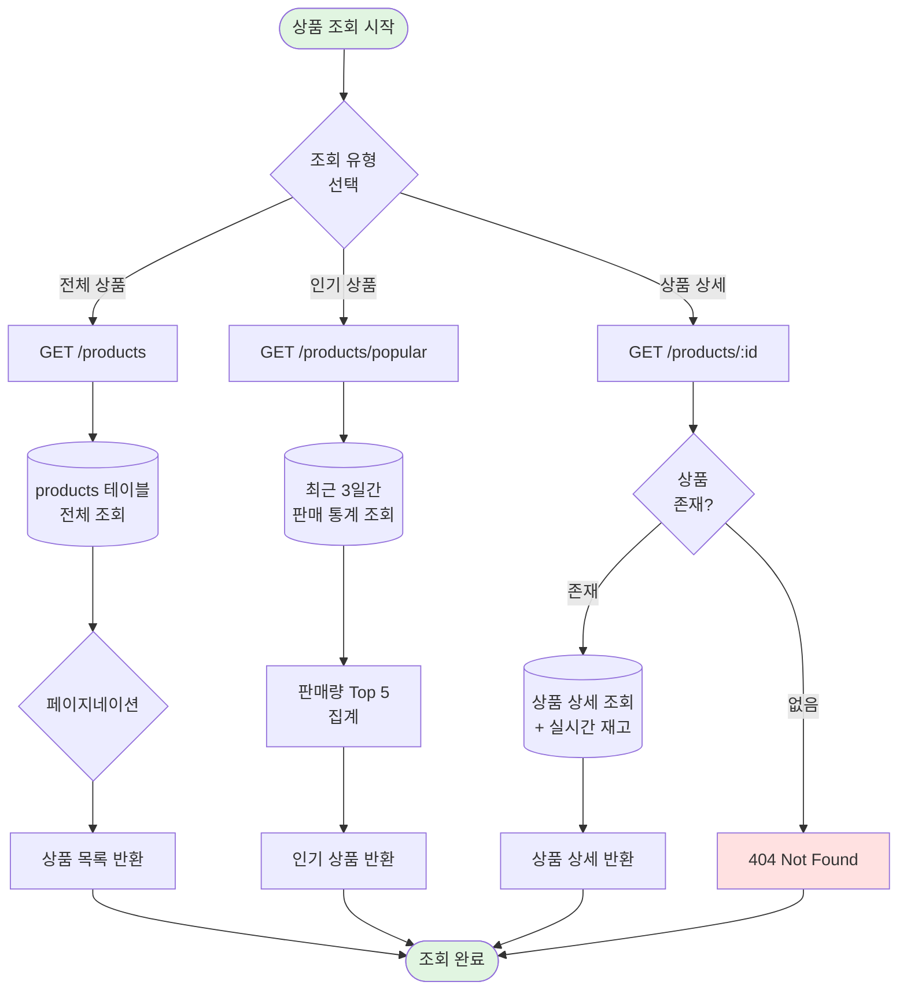
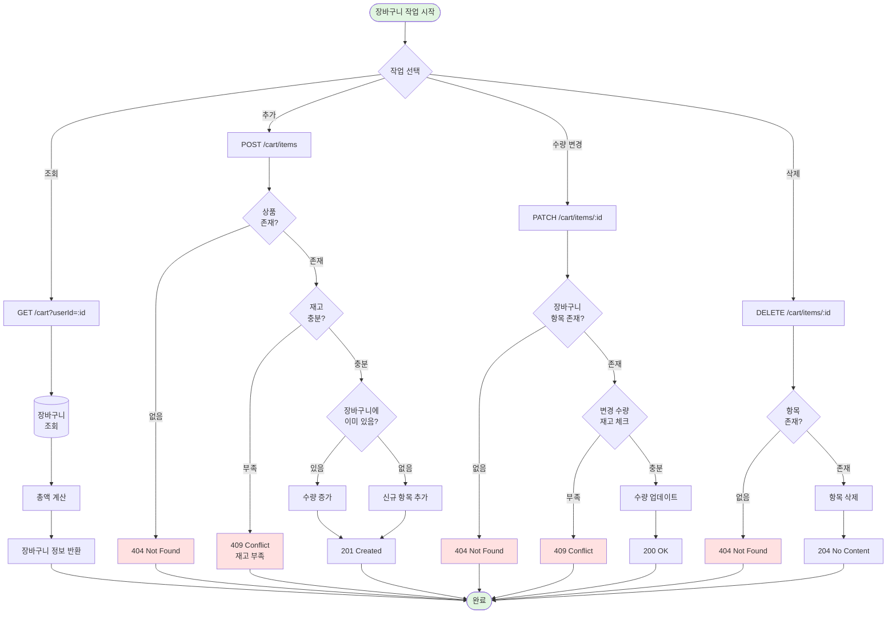
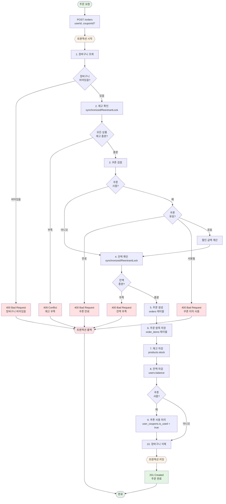
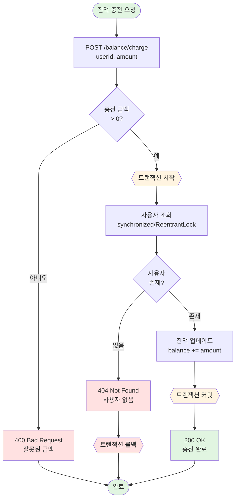
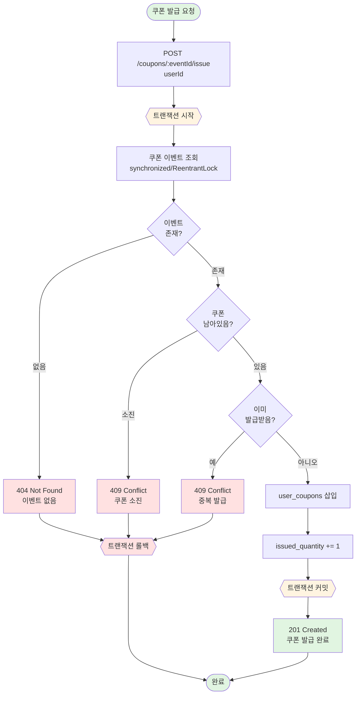
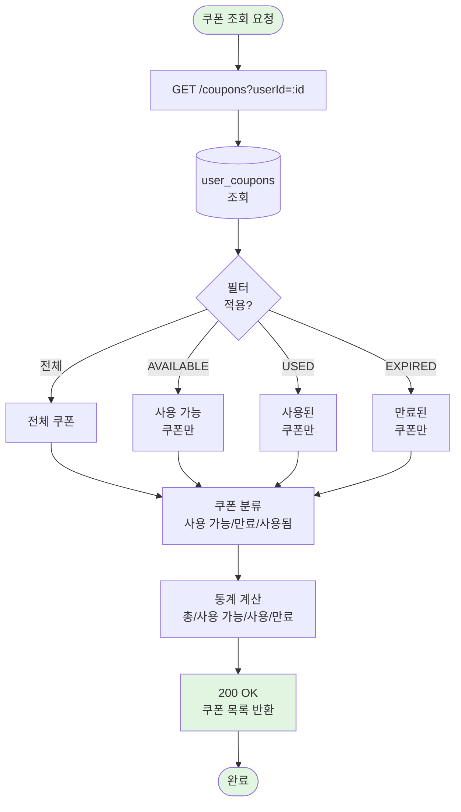

# 이커머스 서비스 플로우차트

## 목차
1. [전체 시스템 플로우](#1-전체-시스템-플로우)
2. [상품 조회 플로우](#2-상품-조회-플로우)
3. [장바구니 플로우](#3-장바구니-플로우)
4. [주문 및 결제 플로우](#4-주문-및-결제-플로우)
5. [쿠폰 시스템 플로우](#5-쿠폰-시스템-플로우)

---

## 1. 전체 시스템 플로우
생략략

## 2. 상품 조회 플로우

### 2.1 상품 목록 및 상세 조회



**Related**: US-PROD-001, US-PROD-002, US-PROD-003

---

## 3. 장바구니 플로우

### 3.1 장바구니 관리 플로우



**Related**: US-CART-001, US-CART-002, US-CART-003, US-CART-004

---

## 4. 주문 및 결제 플로우

### 4.1 주문 생성 및 결제 처리 (상세 플로우)



**Related**: US-ORDR-001, US-PAY-003, US-PAY-004, NFR-INTG-004

---

### 4.2 잔액 충전 플로우



**Related**: US-PAY-002

---

## 5. 쿠폰 시스템 플로우

### 5.1 선착순 쿠폰 발급 플로우



**Related**: US-COUP-001, US-COUP-003, NFR-INTG-002

---

### 5.2 쿠폰 조회 플로우



**Related**: US-COUP-002

---

## 7. 플로우차트 범례

### 8.1 노드 유형

| 모양 | 의미 | 예시 |
|------|------|------|
| `([텍스트])` | 시작/종료 | 프로세스 시작/완료 |
| `[텍스트]` | 프로세스/작업 | API 호출, DB 조회 |
| `{텍스트}` | 의사결정 | 조건 분기 |
| `[(텍스트)]` | 데이터베이스 | DB 조회/저장 |
| `{{텍스트}}` | 트랜잭션 경계 | 시작/커밋/롤백 |

### 8.2 색상 규칙

| 색상 | 의미 |
|------|------|
| <span style="color: #e1f5e1">■</span> 연한 녹색 | 시작/성공/완료 |
| <span style="color: #ffe1e1">■</span> 연한 빨강 | 에러/실패 |
| <span style="color: #fff4e1">■</span> 연한 노랑 | 트랜잭션 경계 |
| <span style="color: #d4edda">■</span> 진한 녹색 | 커밋 완료 |

### 8.3 주요 패턴

#### 트랜잭션 패턴
```
{{트랜잭션 시작}} → 작업들 → {{트랜잭션 커밋}}
                    ↓
                 실패 시
                    ↓
            {{트랜잭션 롤백}}
```

#### 동시성 제어 패턴
```
FOR UPDATE → 락 획득 → 처리 → 커밋 (락 해제)
```

#### 에러 처리 패턴
```
검증 → 에러 발견 → 적절한 HTTP 상태 코드 반환
```

---

## 9. 핵심 비즈니스 플로우 요약

### 9.1 주요 플로우 체크리스트

| 플로우 | 트랜잭션 | 동시성 제어 | 핵심 검증 |
|--------|---------|-----------|---------|
| **상품 조회** | 불필요 | 불필요 | 상품 존재 여부 |
| **장바구니 추가** | 선택적 | 불필요 | 재고 확인, 중복 체크 |
| **주문 생성** | 필수 | synchronized/ReentrantLock (재고/잔액) | 재고/잔액/쿠폰 검증 |
| **잔액 충전** | 필수 | synchronized/ReentrantLock (잔액) | 금액 양수 체크 |
| **쿠폰 발급** | 필수 | synchronized/ReentrantLock (쿠폰 수량) | 쿠폰 수량, 중복 발급 |

### 9.2 트랜잭션 범위 정리

#### 주문 생성 트랜잭션 (가장 복잡)
1. 장바구니 조회
2. 재고 확인 (synchronized/ReentrantLock)
3. 쿠폰 검증 (선택)
4. 잔액 확인 (synchronized/ReentrantLock)
5. 주문 생성
6. 주문 항목 저장
7. 재고 차감
8. 잔액 차감
9. 쿠폰 사용 처리
10. 장바구니 삭제

→ **All or Nothing**: 모든 단계 성공 시 커밋, 하나라도 실패 시 롤백
