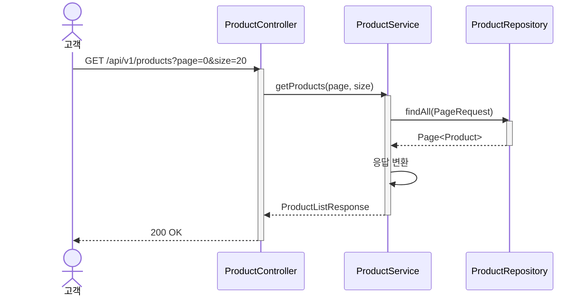
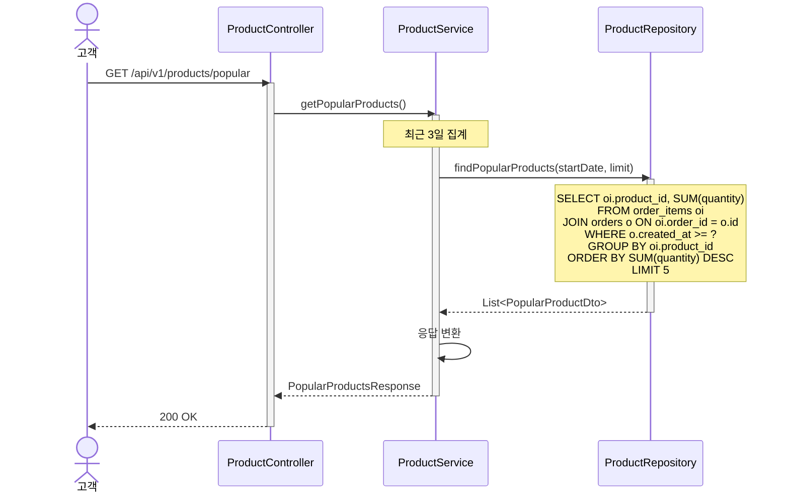
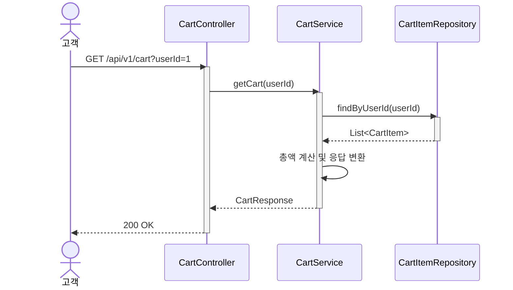
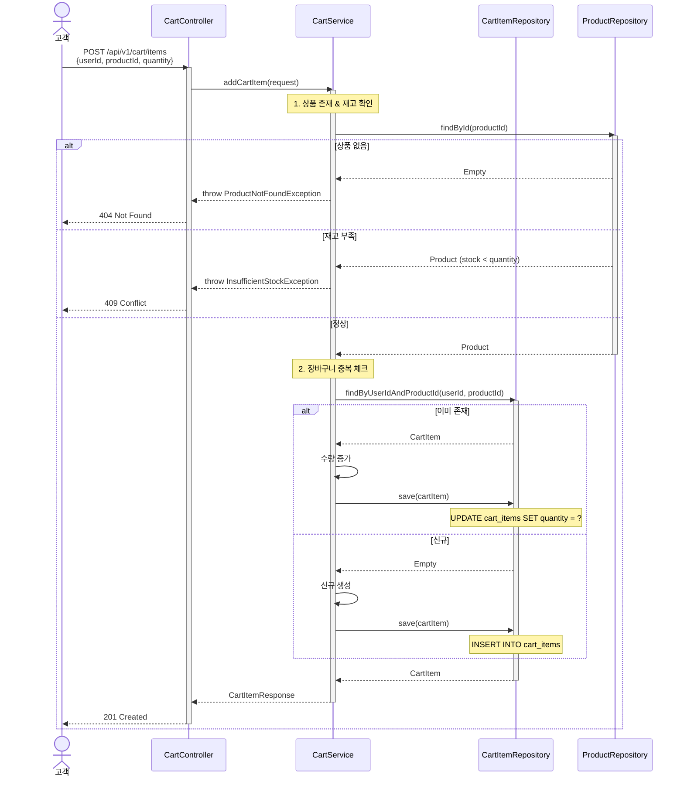
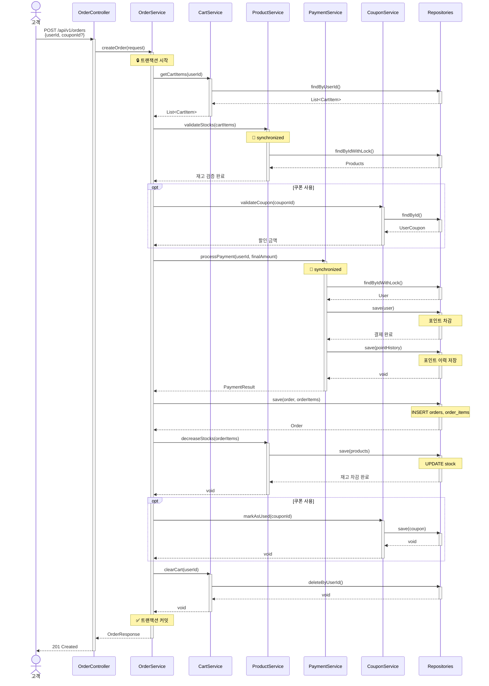
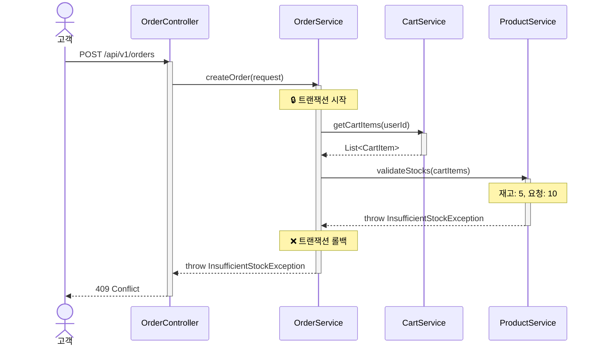
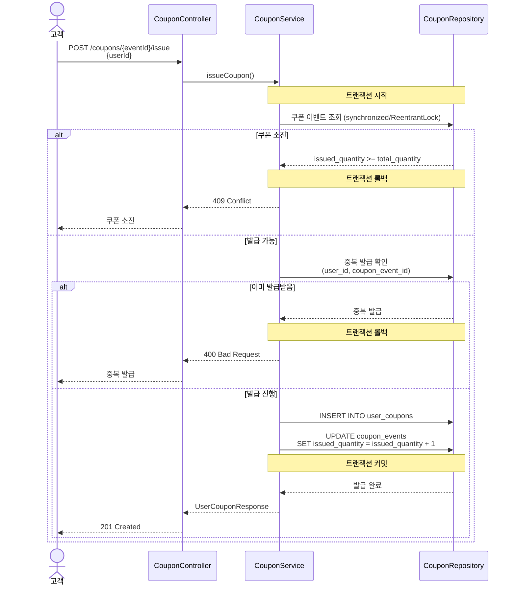
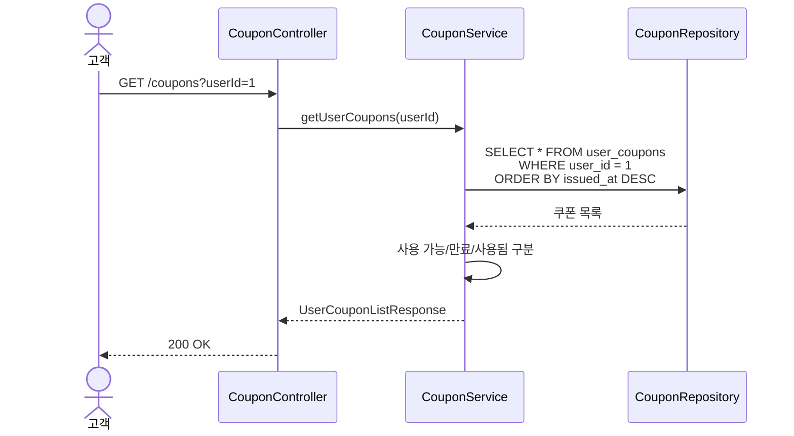

# 이커머스 서비스 시퀀스 다이어그램

## 목차
1. [상품 조회](#1-상품-조회)
2. [장바구니](#2-장바구니)
3. [주문 및 결제](#3-주문-및-결제)
4. [쿠폰 발급](#4-쿠폰-발급)

---

## 1. 상품 조회

### 1.1 상품 목록 조회

**Related**: US-PROD-001, FR-PROD-001~005

---

### 1.2 인기 상품 조회 (최근 3일 Top 5)

**Related**: US-PROD-003, FR-STAT-001~003

---

## 2. 장바구니

### 2.1 장바구니 조회

**Related**: US-CART-002

---

### 2.2 장바구니에 상품 추가

**Related**: US-CART-001

---

## 3. 주문 및 결제

### 3.1 주문 생성 및 결제 (성공 플로우)

**Related**: US-ORDR-001, US-PAY-003, US-PAY-004

---

### 3.2 주문 실패 시나리오

**Related**: US-ORDR-001, US-PAY-003

---

## 4. 쿠폰 발급

### 4.1 선착순 쿠폰 발급 (성공)

**Related**: US-COUP-001, US-COUP-003

---

### 4.2 보유 쿠폰 조회

**Related**: US-COUP-002
