# 이커머스 서비스 시퀀스 다이어그램

## 목차
1. [상품 조회](#1-상품-조회)
2. [장바구니](#2-장바구니)
3. [주문 및 결제](#3-주문-및-결제)
4. [쿠폰 발급](#4-쿠폰-발급)

---

## 1. 상품 조회

### 1.1 상품 목록 조회

```mermaid
sequenceDiagram
    actor 고객
    participant Controller as ProductController
    participant Service as ProductService
    participant Repository as ProductRepository

    고객->>Controller: GET /api/v1/products?page=0&size=20
    activate Controller

    Controller->>Service: getProducts(page, size)
    activate Service

    Service->>Repository: findAll(PageRequest)
    activate Repository
    Repository-->>Service: Page<Product>
    deactivate Repository

    Service->>Service: 응답 변환
    Service-->>Controller: ProductListResponse
    deactivate Service

    Controller-->>고객: 200 OK
    deactivate Controller
```

**Related**: US-PROD-001, FR-PROD-001~005

---

### 1.2 인기 상품 조회 (최근 3일 Top 5)

```mermaid
sequenceDiagram
    actor 고객
    participant Controller as ProductController
    participant Service as ProductService
    participant Repository as ProductRepository

    고객->>Controller: GET /api/v1/products/popular
    activate Controller

    Controller->>Service: getPopularProducts()
    activate Service

    Note over Service: 최근 3일 집계

    Service->>Repository: findPopularProducts(startDate, limit)
    activate Repository
    Note over Repository: SELECT oi.product_id, SUM(quantity)<br/>FROM order_items oi<br/>JOIN orders o ON oi.order_id = o.id<br/>WHERE o.created_at >= ?<br/>GROUP BY oi.product_id<br/>ORDER BY SUM(quantity) DESC<br/>LIMIT 5
    Repository-->>Service: List<PopularProductDto>
    deactivate Repository

    Service->>Service: 응답 변환
    Service-->>Controller: PopularProductsResponse
    deactivate Service

    Controller-->>고객: 200 OK
    deactivate Controller
```

**Related**: US-PROD-003, FR-STAT-001~003

---

## 2. 장바구니

### 2.1 장바구니 조회

```mermaid
sequenceDiagram
    actor 고객
    participant Controller as CartController
    participant Service as CartService
    participant Repository as CartItemRepository

    고객->>Controller: GET /api/v1/cart?userId=1
    activate Controller

    Controller->>Service: getCart(userId)
    activate Service

    Service->>Repository: findByUserId(userId)
    activate Repository
    Repository-->>Service: List<CartItem>
    deactivate Repository

    Service->>Service: 총액 계산 및 응답 변환
    Service-->>Controller: CartResponse
    deactivate Service

    Controller-->>고객: 200 OK
    deactivate Controller
```

**Related**: US-CART-002

---

### 2.2 장바구니에 상품 추가

```mermaid
sequenceDiagram
    actor 고객
    participant Controller as CartController
    participant Service as CartService
    participant CartRepo as CartItemRepository
    participant ProductRepo as ProductRepository

    고객->>Controller: POST /api/v1/cart/items<br/>{userId, productId, quantity}
    activate Controller

    Controller->>Service: addCartItem(request)
    activate Service

    Note over Service: 1. 상품 존재 & 재고 확인
    Service->>ProductRepo: findById(productId)
    activate ProductRepo

    alt 상품 없음
        ProductRepo-->>Service: Empty
        Service-->>Controller: throw ProductNotFoundException
        Controller-->>고객: 404 Not Found
    else 재고 부족
        ProductRepo-->>Service: Product (stock < quantity)
        Service-->>Controller: throw InsufficientStockException
        Controller-->>고객: 409 Conflict
    else 정상
        ProductRepo-->>Service: Product
        deactivate ProductRepo

        Note over Service: 2. 장바구니 중복 체크
        Service->>CartRepo: findByUserIdAndProductId(userId, productId)
        activate CartRepo

        alt 이미 존재
            CartRepo-->>Service: CartItem
            Service->>Service: 수량 증가
            Service->>CartRepo: save(cartItem)
            Note over CartRepo: UPDATE cart_items SET quantity = ?
        else 신규
            CartRepo-->>Service: Empty
            Service->>Service: 신규 생성
            Service->>CartRepo: save(cartItem)
            Note over CartRepo: INSERT INTO cart_items
        end

        CartRepo-->>Service: CartItem
        deactivate CartRepo

        Service-->>Controller: CartItemResponse
        deactivate Service
        Controller-->>고객: 201 Created
        deactivate Controller
    end
```

**Related**: US-CART-001

---

## 3. 주문 및 결제

### 3.1 주문 생성 및 결제 (성공 플로우)

```mermaid
sequenceDiagram
    actor 고객
    participant Controller as OrderController
    participant OrderService
    participant CartService
    participant ProductService
    participant PaymentService
    participant CouponService
    participant Repositories as Repositories

    고객->>Controller: POST /api/v1/orders<br/>{userId, couponId?}
    activate Controller

    Controller->>OrderService: createOrder(request)
    activate OrderService

    Note over OrderService: 🔒 트랜잭션 시작

    %% 1. 장바구니 조회
    OrderService->>CartService: getCartItems(userId)
    activate CartService
    CartService->>Repositories: findByUserId()
    activate Repositories
    Repositories-->>CartService: List<CartItem>
    deactivate Repositories
    CartService-->>OrderService: List<CartItem>
    deactivate CartService

    %% 2. 재고 확인 (동시성 제어)
    OrderService->>ProductService: validateStocks(cartItems)
    activate ProductService
    Note over ProductService: 🔐 synchronized
    ProductService->>Repositories: findByIdWithLock()
    activate Repositories
    Repositories-->>ProductService: Products
    deactivate Repositories
    ProductService-->>OrderService: 재고 검증 완료
    deactivate ProductService

    %% 3. 쿠폰 적용 (선택)
    opt 쿠폰 사용
        OrderService->>CouponService: validateCoupon(couponId)
        activate CouponService
        CouponService->>Repositories: findById()
        activate Repositories
        Repositories-->>CouponService: UserCoupon
        deactivate Repositories
        CouponService-->>OrderService: 할인 금액
        deactivate CouponService
    end

    %% 4. 포인트 결제 처리 (동시성 제어)
    OrderService->>PaymentService: processPayment(userId, finalAmount)
    activate PaymentService
    Note over PaymentService: 🔐 synchronized
    PaymentService->>Repositories: findByIdWithLock()
    activate Repositories
    Repositories-->>PaymentService: User
    deactivate Repositories
    PaymentService->>Repositories: save(user)
    activate Repositories
    Note over Repositories: 포인트 차감
    Repositories-->>PaymentService: 결제 완료
    deactivate Repositories
    PaymentService->>Repositories: save(pointHistory)
    activate Repositories
    Note over Repositories: 포인트 이력 저장
    Repositories-->>PaymentService: void
    deactivate Repositories
    PaymentService-->>OrderService: PaymentResult
    deactivate PaymentService

    %% 5. 주문 저장
    OrderService->>Repositories: save(order, orderItems)
    activate Repositories
    Note over Repositories: INSERT orders, order_items
    Repositories-->>OrderService: Order
    deactivate Repositories

    %% 6. 재고 차감
    OrderService->>ProductService: decreaseStocks(orderItems)
    activate ProductService
    ProductService->>Repositories: save(products)
    activate Repositories
    Note over Repositories: UPDATE stock
    Repositories-->>ProductService: 재고 차감 완료
    deactivate Repositories
    ProductService-->>OrderService: void
    deactivate ProductService

    %% 7. 쿠폰 사용 처리
    opt 쿠폰 사용
        OrderService->>CouponService: markAsUsed(couponId)
        activate CouponService
        CouponService->>Repositories: save(coupon)
        activate Repositories
        Repositories-->>CouponService: void
        deactivate Repositories
        CouponService-->>OrderService: void
        deactivate CouponService
    end

    %% 8. 장바구니 비우기
    OrderService->>CartService: clearCart(userId)
    activate CartService
    CartService->>Repositories: deleteByUserId()
    activate Repositories
    Repositories-->>CartService: void
    deactivate Repositories
    CartService-->>OrderService: void
    deactivate CartService

    Note over OrderService: ✅ 트랜잭션 커밋

    OrderService-->>Controller: OrderResponse
    deactivate OrderService

    Controller-->>고객: 201 Created
    deactivate Controller
```

**Related**: US-ORDR-001, US-PAY-003, US-PAY-004

---

### 3.2 주문 실패 시나리오

```mermaid
sequenceDiagram
    actor 고객
    participant Controller as OrderController
    participant OrderService
    participant CartService
    participant ProductService

    고객->>Controller: POST /api/v1/orders
    activate Controller

    Controller->>OrderService: createOrder(request)
    activate OrderService

    Note over OrderService: 🔒 트랜잭션 시작

    OrderService->>CartService: getCartItems(userId)
    activate CartService
    CartService-->>OrderService: List<CartItem>
    deactivate CartService

    OrderService->>ProductService: validateStocks(cartItems)
    activate ProductService
    Note over ProductService: 재고: 5, 요청: 10
    ProductService-->>OrderService: throw InsufficientStockException
    deactivate ProductService

    Note over OrderService: ❌ 트랜잭션 롤백

    OrderService-->>Controller: throw InsufficientStockException
    deactivate OrderService

    Controller-->>고객: 409 Conflict
    deactivate Controller
```

**Related**: US-ORDR-001, US-PAY-003

---

## 4. 쿠폰 발급

### 4.1 선착순 쿠폰 발급 (성공)

```mermaid
sequenceDiagram
    actor 고객
    participant CouponController
    participant CouponService
    participant CouponRepository

    고객->>CouponController: POST /coupons/{eventId}/issue<br/>{userId}
    CouponController->>CouponService: issueCoupon()

    Note over CouponService,CouponRepository: 트랜잭션 시작

    CouponService->>CouponRepository: 쿠폰 이벤트 조회 (synchronized/ReentrantLock)

    alt 쿠폰 소진
        CouponRepository-->>CouponService: issued_quantity >= total_quantity
        Note over CouponService,CouponRepository: 트랜잭션 롤백
        CouponService-->>CouponController: 409 Conflict
        CouponController-->>고객: 쿠폰 소진

    else 발급 가능
        CouponService->>CouponRepository: 중복 발급 확인<br/>(user_id, coupon_event_id)

        alt 이미 발급받음
            CouponRepository-->>CouponService: 중복 발급
            Note over CouponService,CouponRepository: 트랜잭션 롤백
            CouponService-->>CouponController: 400 Bad Request
            CouponController-->>고객: 중복 발급

        else 발급 진행
            CouponService->>CouponRepository: INSERT INTO user_coupons
            CouponService->>CouponRepository: UPDATE coupon_events<br/>SET issued_quantity = issued_quantity + 1

            Note over CouponService,CouponRepository: 트랜잭션 커밋

            CouponRepository-->>CouponService: 발급 완료
            CouponService-->>CouponController: UserCouponResponse
            CouponController-->>고객: 201 Created
        end
    end
```

**Related**: US-COUP-001, US-COUP-003

---

### 4.2 보유 쿠폰 조회

```mermaid
sequenceDiagram
    actor 고객
    participant CouponController
    participant CouponService
    participant CouponRepository

    고객->>CouponController: GET /coupons?userId=1
    CouponController->>CouponService: getUserCoupons(userId)
    CouponService->>CouponRepository: SELECT * FROM user_coupons<br/>WHERE user_id = 1<br/>ORDER BY issued_at DESC
    CouponRepository-->>CouponService: 쿠폰 목록
    CouponService->>CouponService: 사용 가능/만료/사용됨 구분
    CouponService-->>CouponController: UserCouponListResponse
    CouponController-->>고객: 200 OK
```

**Related**: US-COUP-002
