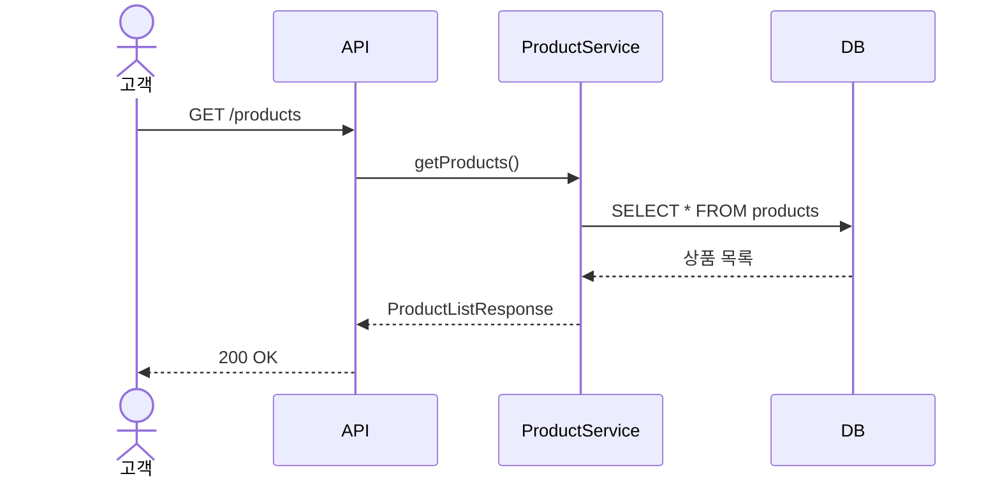
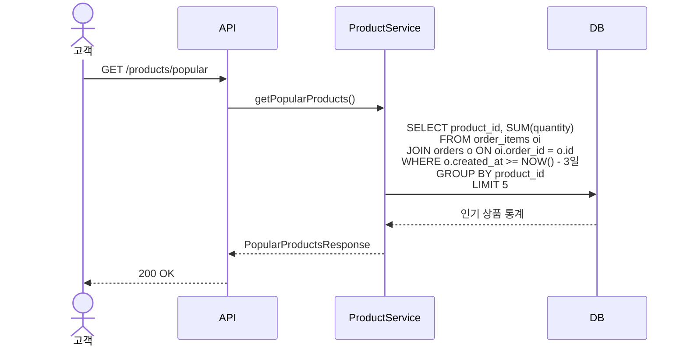
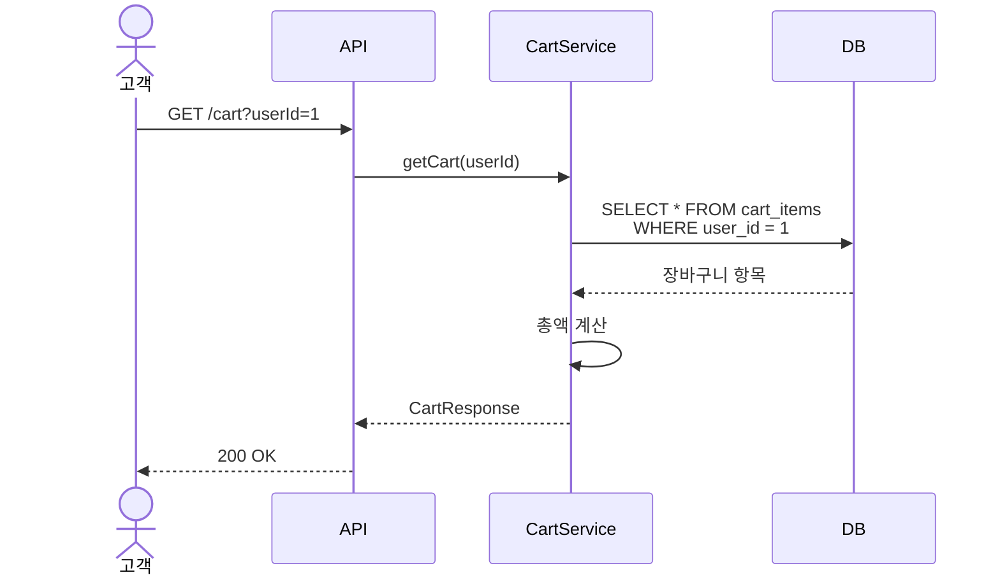
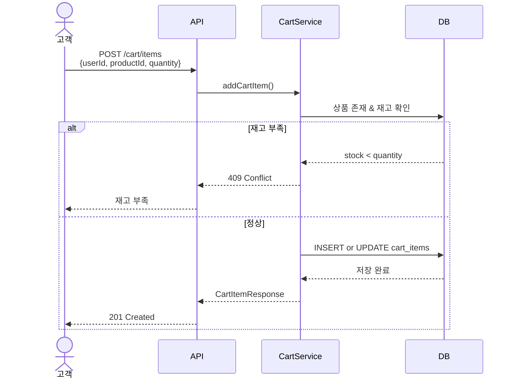
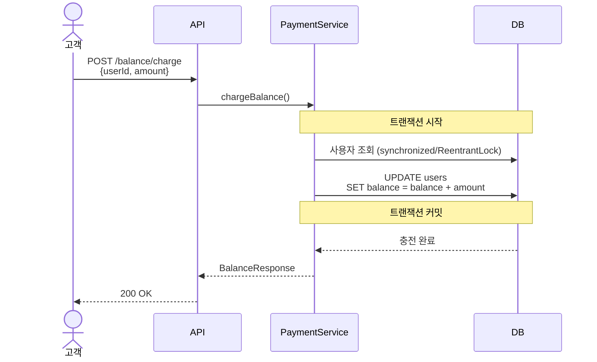
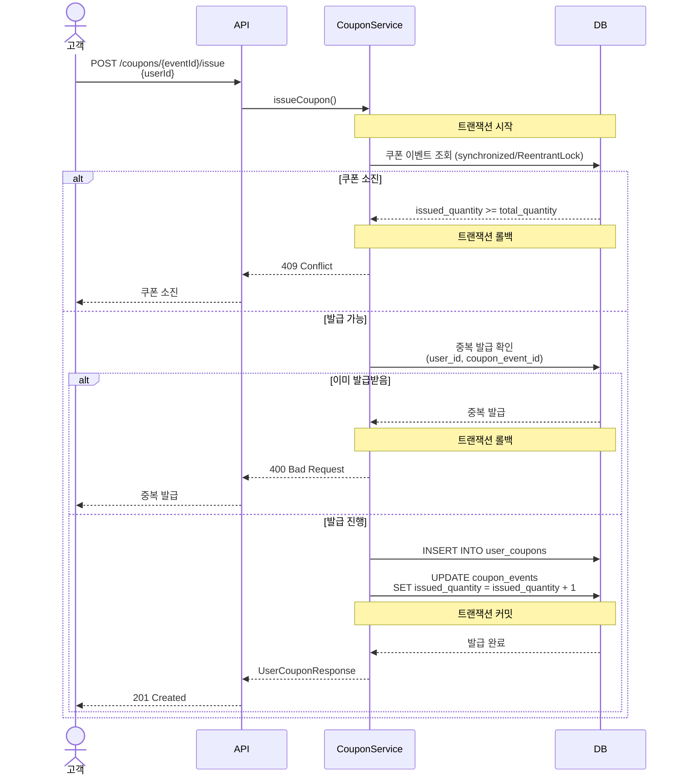
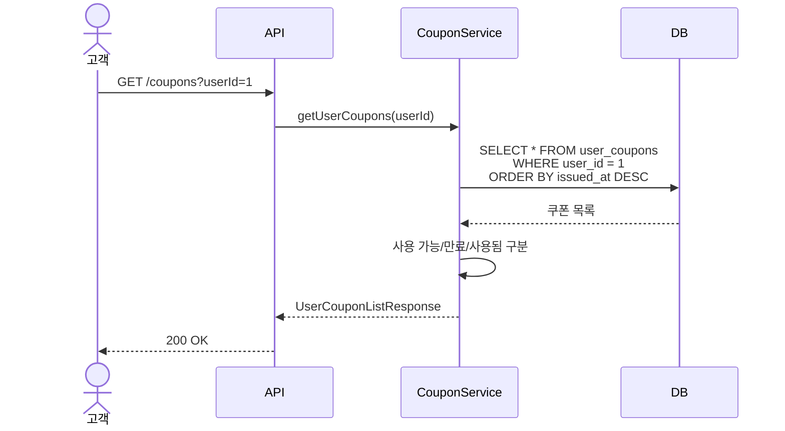

# 이커머스 서비스 시퀀스 다이어그램

## 목차
1. [상품 조회](#1-상품-조회)
2. [장바구니](#2-장바구니)
3. [주문 및 결제](#3-주문-및-결제)
4. [쿠폰 발급](#4-쿠폰-발급)

---

## 1. 상품 조회

### 1.1 상품 목록 조회



**Related**: US-PROD-001, FR-PROD-001~005

---

### 1.2 인기 상품 조회 (최근 3일 Top 5)



**Related**: US-PROD-003, FR-STAT-001~003

---

## 2. 장바구니

### 2.1 장바구니 조회



**Related**: US-CART-002

---

### 2.2 장바구니에 상품 추가



**Related**: US-CART-001

---

## 3. 주문 및 결제

### 3.1 주문 생성 및 결제 (성공 플로우)


**Related**: US-ORDR-001, US-PAY-003, US-PAY-004

---

### 3.2 주문 실패 시나리오


**Related**: US-ORDR-001, US-PAY-003

---

### 3.3 잔액 충전



**Related**: US-PAY-002

---

## 4. 쿠폰 발급

### 4.1 선착순 쿠폰 발급 (성공)



**Related**: US-COUP-001, US-COUP-003

---

### 4.2 보유 쿠폰 조회



**Related**: US-COUP-002

---

## 5. 핵심 패턴 요약

### 5.1 동시성 제어 (synchronized/ReentrantLock)

```java
// 재고 차감 시
private final ReentrantLock stockLock = new ReentrantLock();

public void decreaseStock(Long productId, int quantity) {
    stockLock.lock();
    try {
        Product product = productRepository.findById(productId);
        product.decreaseStock(quantity);
        productRepository.save(product);
    } finally {
        stockLock.unlock();
    }
}

// 쿠폰 발급 시
private final ReentrantLock couponLock = new ReentrantLock();

public void issueCoupon(Long couponEventId, Long userId) {
    couponLock.lock();
    try {
        CouponEvent event = couponEventRepository.findById(couponEventId);
        event.increaseIssuedQuantity();
        // 쿠폰 발급 처리
    } finally {
        couponLock.unlock();
    }
}

// 잔액 차감 시
public synchronized void updateBalance(Long userId, long amount) {
    User user = userRepository.findById(userId);
    user.updateBalance(amount);
    userRepository.save(user);
}
```

### 5.2 트랜잭션 범위

**주문 생성 트랜잭션 (원자성 보장)**:
1. 장바구니 조회
2. 재고 확인 및 락 획득
3. 쿠폰 검증 (선택)
4. 잔액 확인 및 락 획득
5. 주문 생성
6. 주문 항목 저장
7. 재고 차감
8. 잔액 차감
9. 쿠폰 사용 처리
10. 장바구니 삭제

→ 모든 작업이 성공하면 커밋, 하나라도 실패하면 롤백

### 5.3 에러 처리 우선순위

1. **비즈니스 검증** (400 Bad Request)
   - 잘못된 파라미터
   - 쿠폰 만료/사용됨

2. **리소스 없음** (404 Not Found)
   - 상품/주문/쿠폰 없음

3. **리소스 충돌** (409 Conflict)
   - 재고 부족
   - 쿠폰 소진
   - 잔액 부족

---

## 다이어그램 범례

### 참여자
- **고객**: 실제 사용자 (Actor)
- **API**: RESTful API 엔드포인트
- **Service**: 비즈니스 로직 레이어
- **DB**: 데이터베이스

### 주요 표기
- `synchronized/ReentrantLock`: 애플리케이션 레벨 동시성 제어
- `트랜잭션 시작/커밋/롤백`: 원자성 보장
- `alt-else`: 조건 분기 (에러 처리)

---

## 변경 이력

| 버전 | 날짜 | 변경 내용 |
|------|------|----------|
| v1.0 | 2025-10-29 | 초기 버전 작성 |
| v2.0 | 2025-10-29 | 도메인별 핵심 플로우로 단순화 |
