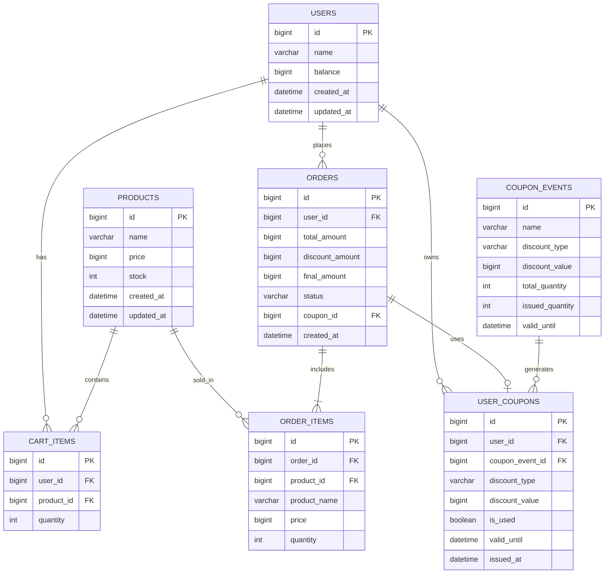

# 이커머스 서비스 데이터 모델

## 목차
1. [개요](#1-개요)
2. [ERD (Entity Relationship Diagram)](#2-erd-entity-relationship-diagram)
3. [엔티티 상세 명세](#3-엔티티-상세-명세)
4. [인덱스 전략](#4-인덱스-전략)
5. [테이블 생성 DDL](#5-테이블-생성-ddl)

---

## 1. 개요

### 1.1 설계 원칙
- **최소화**: 핵심 기능에 필요한 테이블과 컬럼만 포함
- **정규화**: 3NF까지 정규화하되 복잡성 최소화
- **성능**: 조회 성능을 위한 최소한의 인덱스만 설계
- **무결성**: 애플리케이션 레벨에서 참조 무결성 관리 (FK 제약 없음)

### 1.2 포함 테이블 (총 7개)
1. **users** - 사용자 및 잔액
2. **products** - 상품 및 재고
3. **cart_items** - 장바구니
4. **orders** - 주문
5. **order_items** - 주문 상품
6. **coupon_events** - 쿠폰 이벤트
7. **user_coupons** - 사용자 쿠폰

### 1.3 제외된 기능
- **결제 이력 테이블** (payments): orders 테이블로 통합
- **잔액 이력 테이블** (balance_history): 요구사항에 없음
- **데이터 동기화 이력** (data_sync_history): 외부 연동은 애플리케이션 레벨에서 처리

### 1.4 FK 제약 조건 제거
- **DDL**: FK 제약 조건 없음 (애플리케이션 레벨 관리)
- **ERD**: 논리적 관계 표현을 위해 관계선 유지
- **장점**: 유연한 스키마 변경, 성능 향상, 순환 참조 해결

---

## 2. ERD (Entity Relationship Diagram)



---

## 3. 엔티티 상세 명세

### 3.1 USERS (사용자)

**테이블명**: `users`

| 컬럼명 | 타입 | NULL | 기본값 | 설명 |
|--------|------|------|--------|------|
| id | BIGINT | NO | AUTO_INCREMENT | 사용자 ID (PK) |
| name | VARCHAR(100) | NO | - | 사용자 이름 |
| balance | BIGINT | NO | 0 | 잔액 (원 단위) |
| created_at | DATETIME | NO | CURRENT_TIMESTAMP | 생성 일시 |
| updated_at | DATETIME | NO | CURRENT_TIMESTAMP | 수정 일시 |

**제약 조건**:
- PRIMARY KEY: `id`
- CHECK: `balance >= 0`

**인덱스**:
- PRIMARY: `id`

---

### 3.2 PRODUCTS (상품)

**테이블명**: `products`

| 컬럼명 | 타입 | NULL | 기본값 | 설명 |
|--------|------|------|--------|------|
| id | BIGINT | NO | AUTO_INCREMENT | 상품 ID (PK) |
| name | VARCHAR(200) | NO | - | 상품명 |
| price | BIGINT | NO | - | 가격 (원 단위) |
| stock | INT | NO | 0 | 재고 수량 |
| created_at | DATETIME | NO | CURRENT_TIMESTAMP | 생성 일시 |
| updated_at | DATETIME | NO | CURRENT_TIMESTAMP | 수정 일시 |

**제약 조건**:
- PRIMARY KEY: `id`
- CHECK: `price > 0`
- CHECK: `stock >= 0`

**인덱스**:
- PRIMARY: `id`

**비즈니스 규칙**:
- 재고 차감 시 `SELECT FOR UPDATE` 사용 (비관적 락)

---

### 3.3 CART_ITEMS (장바구니)

**테이블명**: `cart_items`

| 컬럼명 | 타입 | NULL | 기본값 | 설명 |
|--------|------|------|--------|------|
| id | BIGINT | NO | AUTO_INCREMENT | 장바구니 항목 ID (PK) |
| user_id | BIGINT | NO | - | 사용자 ID (FK) |
| product_id | BIGINT | NO | - | 상품 ID (FK) |
| quantity | INT | NO | 1 | 수량 |

**제약 조건**:
- PRIMARY KEY: `id`
- UNIQUE: (`user_id`, `product_id`) - 사용자당 상품 중복 방지
- CHECK: `quantity >= 1`

**인덱스**:
- PRIMARY: `id`
- UNIQUE INDEX: `idx_cart_user_product` ON (`user_id`, `product_id`)

**참조 관계** (애플리케이션 레벨):
- `user_id` → `users(id)`
- `product_id` → `products(id)`

---

### 3.4 ORDERS (주문)

**테이블명**: `orders`

| 컬럼명 | 타입 | NULL | 기본값 | 설명 |
|--------|------|------|--------|------|
| id | BIGINT | NO | AUTO_INCREMENT | 주문 ID (PK) |
| user_id | BIGINT | NO | - | 사용자 ID (FK) |
| total_amount | BIGINT | NO | - | 원래 금액 |
| discount_amount | BIGINT | NO | 0 | 할인 금액 |
| final_amount | BIGINT | NO | - | 최종 결제 금액 |
| status | VARCHAR(20) | NO | 'COMPLETED' | 주문 상태 |
| coupon_id | BIGINT | YES | NULL | 사용된 쿠폰 ID (FK) |
| created_at | DATETIME | NO | CURRENT_TIMESTAMP | 주문 일시 |

**제약 조건**:
- PRIMARY KEY: `id`
- CHECK: `status IN ('COMPLETED', 'FAILED')`

**인덱스**:
- PRIMARY: `id`
- INDEX: `idx_orders_user_created` ON (`user_id`, `created_at` DESC)
- INDEX: `idx_orders_created` ON (`created_at`) - 인기 상품 집계용

**참조 관계** (애플리케이션 레벨):
- `user_id` → `users(id)`
- `coupon_id` → `user_coupons(id)` (nullable)

**비즈니스 규칙**:
- `final_amount = total_amount - discount_amount`
- 주문-결제-재고차감은 하나의 트랜잭션

---

### 3.5 ORDER_ITEMS (주문 항목)

**테이블명**: `order_items`

| 컬럼명 | 타입 | NULL | 기본값 | 설명 |
|--------|------|------|--------|------|
| id | BIGINT | NO | AUTO_INCREMENT | 주문 항목 ID (PK) |
| order_id | BIGINT | NO | - | 주문 ID (FK) |
| product_id | BIGINT | NO | - | 상품 ID (FK) |
| product_name | VARCHAR(200) | NO | - | 주문 당시 상품명 |
| price | BIGINT | NO | - | 주문 당시 가격 |
| quantity | INT | NO | - | 수량 |

**제약 조건**:
- PRIMARY KEY: `id`
- CHECK: `price > 0`
- CHECK: `quantity >= 1`

**인덱스**:
- PRIMARY: `id`
- INDEX: `idx_order_items_order` ON (`order_id`)
- INDEX: `idx_order_items_product_created` ON (`product_id`, `order_id`) - 인기 상품 집계용

**참조 관계** (애플리케이션 레벨):
- `order_id` → `orders(id)`
- `product_id` → `products(id)`

---

### 3.6 COUPON_EVENTS (쿠폰 이벤트)

**테이블명**: `coupon_events`

| 컬럼명 | 타입 | NULL | 기본값 | 설명 |
|--------|------|------|--------|------|
| id | BIGINT | NO | AUTO_INCREMENT | 쿠폰 이벤트 ID (PK) |
| name | VARCHAR(100) | NO | - | 쿠폰명 |
| discount_type | VARCHAR(20) | NO | - | 할인 유형 (AMOUNT, RATE) |
| discount_value | BIGINT | NO | - | 할인값 (금액 또는 비율) |
| total_quantity | INT | NO | - | 총 발급 수량 |
| issued_quantity | INT | NO | 0 | 발급된 수량 |
| valid_until | DATETIME | NO | - | 유효 종료 일시 |

**제약 조건**:
- PRIMARY KEY: `id`
- CHECK: `discount_type IN ('AMOUNT', 'RATE')`
- CHECK: `total_quantity > 0`
- CHECK: `issued_quantity >= 0 AND issued_quantity <= total_quantity`

**인덱스**:
- PRIMARY: `id`

**비즈니스 규칙**:
- `issued_quantity` 증가 시 `SELECT FOR UPDATE` 사용 (비관적 락)
- `AMOUNT`: discount_value는 원 단위
- `RATE`: discount_value는 % (예: 10 = 10%)

---

### 3.7 USER_COUPONS (사용자 쿠폰)

**테이블명**: `user_coupons`

| 컬럼명 | 타입 | NULL | 기본값 | 설명 |
|--------|------|------|--------|------|
| id | BIGINT | NO | AUTO_INCREMENT | 사용자 쿠폰 ID (PK) |
| user_id | BIGINT | NO | - | 사용자 ID (FK) |
| coupon_event_id | BIGINT | NO | - | 쿠폰 이벤트 ID (FK) |
| discount_type | VARCHAR(20) | NO | - | 할인 유형 (스냅샷) |
| discount_value | BIGINT | NO | - | 할인값 (스냅샷) |
| is_used | BOOLEAN | NO | FALSE | 사용 여부 |
| valid_until | DATETIME | NO | - | 유효 종료 일시 |
| issued_at | DATETIME | NO | CURRENT_TIMESTAMP | 발급 일시 |

**제약 조건**:
- PRIMARY KEY: `id`
- UNIQUE: (`user_id`, `coupon_event_id`) - 중복 발급 방지
- CHECK: `discount_type IN ('AMOUNT', 'RATE')`

**인덱스**:
- PRIMARY: `id`
- UNIQUE INDEX: `idx_user_coupon_unique` ON (`user_id`, `coupon_event_id`)
- INDEX: `idx_user_coupons_user` ON (`user_id`, `is_used`)

**참조 관계** (애플리케이션 레벨):
- `user_id` → `users(id)`
- `coupon_event_id` → `coupon_events(id)`

**비즈니스 규칙**:
- 발급 시 이벤트 정보를 스냅샷으로 저장
- 사용 시 `is_used = TRUE`로 업데이트

---

## 4. 인덱스 전략

### 4.1 핵심 인덱스

```sql
-- 1. 장바구니: 사용자별 조회 + 중복 방지
CREATE UNIQUE INDEX idx_cart_user_product ON cart_items(user_id, product_id);

-- 2. 주문: 사용자별 최근 주문 조회
CREATE INDEX idx_orders_user_created ON orders(user_id, created_at DESC);

-- 3. 주문: 인기 상품 집계 (최근 3일)
CREATE INDEX idx_orders_created ON orders(created_at);

-- 4. 주문 항목: 주문별 조회
CREATE INDEX idx_order_items_order ON order_items(order_id);

-- 5. 주문 항목: 인기 상품 집계
CREATE INDEX idx_order_items_product_created ON order_items(product_id, order_id);

-- 6. 사용자 쿠폰: 중복 발급 방지 + 조회
CREATE UNIQUE INDEX idx_user_coupon_unique ON user_coupons(user_id, coupon_event_id);

-- 7. 사용자 쿠폰: 사용자별 쿠폰 조회
CREATE INDEX idx_user_coupons_user ON user_coupons(user_id, is_used);
```

### 4.2 인덱스 사용 예시

#### 사용자별 주문 내역 조회
```sql
-- GET /orders?userId=1
SELECT * FROM orders
WHERE user_id = 1
ORDER BY created_at DESC
LIMIT 10;

-- 사용 인덱스: idx_orders_user_created
```

#### 인기 상품 조회 (최근 3일)
```sql
-- GET /products/popular
SELECT oi.product_id, p.name, SUM(oi.quantity) as sales
FROM order_items oi
JOIN orders o ON oi.order_id = o.id
JOIN products p ON oi.product_id = p.id
WHERE o.created_at >= DATE_SUB(NOW(), INTERVAL 3 DAY)
GROUP BY oi.product_id, p.name
ORDER BY sales DESC
LIMIT 5;

-- 사용 인덱스: idx_orders_created, idx_order_items_product_created
```

#### 재고 차감 (동시성 제어)
```sql
-- 비관적 락
SELECT * FROM products WHERE id = 1 FOR UPDATE;
UPDATE products SET stock = stock - 10 WHERE id = 1;

-- 사용 인덱스: PRIMARY KEY
```

---

## 5. 테이블 생성 DDL

**주의**: 모든 FK(Foreign Key) 제약 조건이 제거되었습니다. 참조 무결성은 애플리케이션 레벨에서 관리합니다.

```sql
-- 1. 사용자
CREATE TABLE users (
    id BIGINT AUTO_INCREMENT PRIMARY KEY,
    name VARCHAR(100) NOT NULL,
    balance BIGINT NOT NULL DEFAULT 0,
    created_at DATETIME NOT NULL DEFAULT CURRENT_TIMESTAMP,
    updated_at DATETIME NOT NULL DEFAULT CURRENT_TIMESTAMP ON UPDATE CURRENT_TIMESTAMP,
    CONSTRAINT chk_users_balance CHECK (balance >= 0)
) ENGINE=InnoDB DEFAULT CHARSET=utf8mb4;

-- 2. 상품
CREATE TABLE products (
    id BIGINT AUTO_INCREMENT PRIMARY KEY,
    name VARCHAR(200) NOT NULL,
    price BIGINT NOT NULL,
    stock INT NOT NULL DEFAULT 0,
    created_at DATETIME NOT NULL DEFAULT CURRENT_TIMESTAMP,
    updated_at DATETIME NOT NULL DEFAULT CURRENT_TIMESTAMP ON UPDATE CURRENT_TIMESTAMP,
    CONSTRAINT chk_products_price CHECK (price > 0),
    CONSTRAINT chk_products_stock CHECK (stock >= 0)
) ENGINE=InnoDB DEFAULT CHARSET=utf8mb4;

-- 3. 장바구니
CREATE TABLE cart_items (
    id BIGINT AUTO_INCREMENT PRIMARY KEY,
    user_id BIGINT NOT NULL,
    product_id BIGINT NOT NULL,
    quantity INT NOT NULL DEFAULT 1,
    CONSTRAINT chk_cart_quantity CHECK (quantity >= 1)
) ENGINE=InnoDB DEFAULT CHARSET=utf8mb4;

CREATE UNIQUE INDEX idx_cart_user_product ON cart_items(user_id, product_id);

-- 4. 쿠폰 이벤트
CREATE TABLE coupon_events (
    id BIGINT AUTO_INCREMENT PRIMARY KEY,
    name VARCHAR(100) NOT NULL,
    discount_type VARCHAR(20) NOT NULL,
    discount_value BIGINT NOT NULL,
    total_quantity INT NOT NULL,
    issued_quantity INT NOT NULL DEFAULT 0,
    valid_until DATETIME NOT NULL,
    CONSTRAINT chk_coupon_type CHECK (discount_type IN ('AMOUNT', 'RATE')),
    CONSTRAINT chk_coupon_quantity CHECK (total_quantity > 0 AND issued_quantity >= 0 AND issued_quantity <= total_quantity)
) ENGINE=InnoDB DEFAULT CHARSET=utf8mb4;

-- 5. 사용자 쿠폰
CREATE TABLE user_coupons (
    id BIGINT AUTO_INCREMENT PRIMARY KEY,
    user_id BIGINT NOT NULL,
    coupon_event_id BIGINT NOT NULL,
    discount_type VARCHAR(20) NOT NULL,
    discount_value BIGINT NOT NULL,
    is_used BOOLEAN NOT NULL DEFAULT FALSE,
    valid_until DATETIME NOT NULL,
    issued_at DATETIME NOT NULL DEFAULT CURRENT_TIMESTAMP,
    CONSTRAINT chk_user_coupon_type CHECK (discount_type IN ('AMOUNT', 'RATE'))
) ENGINE=InnoDB DEFAULT CHARSET=utf8mb4;

CREATE UNIQUE INDEX idx_user_coupon_unique ON user_coupons(user_id, coupon_event_id);
CREATE INDEX idx_user_coupons_user ON user_coupons(user_id, is_used);

-- 6. 주문
CREATE TABLE orders (
    id BIGINT AUTO_INCREMENT PRIMARY KEY,
    user_id BIGINT NOT NULL,
    total_amount BIGINT NOT NULL,
    discount_amount BIGINT NOT NULL DEFAULT 0,
    final_amount BIGINT NOT NULL,
    status VARCHAR(20) NOT NULL DEFAULT 'COMPLETED',
    coupon_id BIGINT,
    created_at DATETIME NOT NULL DEFAULT CURRENT_TIMESTAMP,
    CONSTRAINT chk_order_status CHECK (status IN ('COMPLETED', 'FAILED'))
) ENGINE=InnoDB DEFAULT CHARSET=utf8mb4;

CREATE INDEX idx_orders_user_created ON orders(user_id, created_at DESC);
CREATE INDEX idx_orders_created ON orders(created_at);

-- 7. 주문 항목
CREATE TABLE order_items (
    id BIGINT AUTO_INCREMENT PRIMARY KEY,
    order_id BIGINT NOT NULL,
    product_id BIGINT NOT NULL,
    product_name VARCHAR(200) NOT NULL,
    price BIGINT NOT NULL,
    quantity INT NOT NULL,
    CONSTRAINT chk_order_item_price CHECK (price > 0),
    CONSTRAINT chk_order_item_quantity CHECK (quantity >= 1)
) ENGINE=InnoDB DEFAULT CHARSET=utf8mb4;

CREATE INDEX idx_order_items_order ON order_items(order_id);
CREATE INDEX idx_order_items_product_created ON order_items(product_id, order_id);
```

---

## 6. 샘플 데이터

```sql
-- 사용자
INSERT INTO users (name, balance) VALUES
('김철수', 10000000),
('이영희', 5000000),
('박민수', 3000000);

-- 상품
INSERT INTO products (name, price, stock) VALUES
('노트북', 1500000, 50),
('마우스', 30000, 100),
('키보드', 80000, 30),
('모니터', 400000, 20),
('헤드셋', 120000, 40);

-- 쿠폰 이벤트
INSERT INTO coupon_events (name, discount_type, discount_value, total_quantity, valid_until) VALUES
('10,000원 할인 쿠폰', 'AMOUNT', 10000, 1000, '2025-12-31 23:59:59'),
('10% 할인 쿠폰', 'RATE', 10, 500, '2025-11-30 23:59:59');
```

---

## 7. 주요 설계 결정 사항

### 7.1 제거된 컬럼/테이블
1. **products.description** - API 응답에 불필요
2. **payments 테이블** - orders로 통합 (잔액 결제만 지원)
3. **balance_history 테이블** - 요구사항에 없음
4. **data_sync_history 테이블** - 애플리케이션 레벨 처리
5. **타임스탬프 중복** - created_at만 유지 (updated_at 최소화)

### 7.2 단순화된 설계
1. **쿠폰 할인 타입 통합**: FIXED_AMOUNT/PERCENTAGE → AMOUNT/RATE (단순화)
2. **쿠폰 수량 관리**: remaining_quantity → issued_quantity (계산 단순화)
3. **주문 상태**: PENDING 제거 → COMPLETED/FAILED만 사용

### 7.3 FK 제약 조건 제거 이유
1. **유연성**: 스키마 변경 시 제약 조건 수정 불필요
2. **성능**: FK 체크 오버헤드 제거, INSERT/UPDATE 속도 향상
3. **순환 참조 해결**: orders ↔ user_coupons 간 순환 참조 문제 해소
4. **데이터 삭제 유연성**: CASCADE 없이 애플리케이션에서 제어
5. **마이그레이션 간소화**: 테이블 생성 순서 신경쓸 필요 없음

**참조 무결성 보장 방법**:
- 애플리케이션 레벨에서 검증 (서비스 레이어)
- JPA/Hibernate의 @ManyToOne, @OneToMany 관계 활용
- 존재하지 않는 ID 참조 시 예외 처리

### 7.4 동시성 제어
- **재고 차감**: `SELECT FOR UPDATE` (products.stock)
- **쿠폰 발급**: `SELECT FOR UPDATE` (coupon_events.issued_quantity)
- **잔액 차감**: `SELECT FOR UPDATE` (users.balance)

---

## 8. 테이블 요약

| 테이블 | 행 수 | 주요 용도 | 동시성 제어 |
|--------|------|----------|-----------|
| users | 소규모 | 사용자, 잔액 관리 | 비관적 락 |
| products | 소규모 | 상품, 재고 관리 | 비관적 락 |
| cart_items | 중간 | 장바구니 | - |
| orders | 대규모 | 주문 이력 | - |
| order_items | 대규모 | 주문 상품 상세 | - |
| coupon_events | 소규모 | 쿠폰 이벤트 | 비관적 락 |
| user_coupons | 중간 | 발급된 쿠폰 | - |

---

## 변경 이력

| 버전 | 날짜 | 변경 내용 |
|------|------|----------|
| v1.0 | 2025-10-29 | 간소화된 데이터 모델 설계 완료 |
